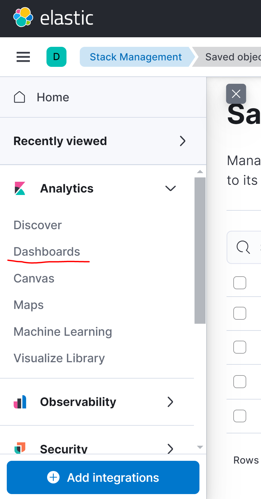

# RoadRiskWatch

Get a real-time estimate on the risk level of a road.
Estimates are based on weather conditions and certain road characteristics.

## Project Requirements

**Note**: *You can skip the second step, and try this project only in Demo Mode*

1. You need to have [Docker](https://docs.docker.com/get-docker/)

2. You need to have these API keys:

- [TomTom](https://developer.tomtom.com/)
- [OpenWeather](https://openweathermap.org/current)

## Project Setup

There are two modes of execution:

- Demo
- Default

#### Demo Mode 

In this mode, you can try the project using fake weather data, and you do not need API keys.

You just need to make sure that the contents of */pipeline/python/input_data/execution_mode.txt*
is *Demo*

#### Default Mode

1. Create a new directory called *keys* inside */pipeline/python/*

2. Create these files inside the new directory:

- *OpenWeather_key.txt*
- *TomTom_key.txt*

3. Insert your personal API keys into these files

4. Change the contents of */pipeline/python/input_data/execution_mode.txt*
    to *Default*

5. Change the contents of */pipeline/python/input_data/addresses.txt*
    to set up the addresses you want, every address must follow this 
    format:

    - *Name of the Road **#** other info*

    Inside the *txt* file, there are two examples: the first line is 
    a US address and the second one is an Italian address

## Execution

1. Open Docker Desktop 

2. Go to */pipeline* and execute the command *docker-compose -f pipeline.yml up --build*

3. Go to [Kibana](http://localhost:5601/app/home)
    If it does not work, wait a few minutes and try again.

4. **You need to do this only the first time you run this project:**
     
    
     

     
    
     

     
    
     
     

    Import the file */pipeline/kibana/objects.ndjson*
     

5.  To view the dashboard follow these steps:

     
    
     

     
    
     

## Data Visualization

Example with Italian roads:

 

 